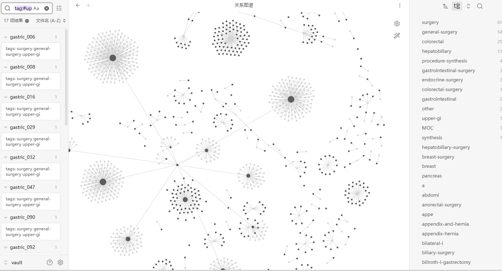

# SurgicalWiki Pro

> **Evidence-based surgical knowledge wiki built from 583 de-identified operative notes**
> Formally verified with Prolog · LLM-synthesised · Obsidian-native

---

> **PRIVATE REPOSITORY** — Authorized access only.
> See [LICENSE](LICENSE). Clinical disclaimer below.

---

## What Is This?

#### Knowledge Graph

583 de-identified operative notes form a multi-hub radial graph in Obsidian.
Large nodes are subspecialty synthesis reports and MOC pages; surrounding
satellite nodes are individual case pages.

> Tag distribution: surgery 61 · general-surgery 54 · colorectal 25 · hepatobiliary 11 · procedure-synthesis 4

SurgicalWiki Pro is an evidence-based surgical knowledge wiki built from
583 de-identified general surgery operative notes. It combines three
technical layers absent from any existing surgical education platform:

**Layer 1 — Formal Prolog Verification**
Every surgical fact in the wiki is cross-checked against a hand-crafted
Prolog knowledge base (`rules/surgical_rules.pl`) encoding:
- Anatomical structure protection rules
- Procedural sequencing constraints (what must precede what)
- Anastomosis standards (tension-free, blood supply, no distal obstruction)
- Drain indications and placement rules
- Complication risk classifications (high / moderate / low)
- Procedural contraindications and cautions

**Layer 2 — Cross-Case Evidence Synthesis**
The synthesiser (`pipeline/surgical_synthesizer.py`) aggregates patterns
across all 583 cases per subspecialty and procedure type. Example output:
> *"Across 67 Billroth II cases, combined splenectomy occurred in 18% of
> cases. The most commonly documented intraoperative finding was..."*

No existing tool produces this level of synthesis from a real institutional
case series.

**Layer 3 — Three-Layer Contamination Defence**
Adapted from peer-reviewed research on LLM wiki contamination propagation
(Zhang et al., NeurIPS Workshop 2025), the pipeline prevents hallucinations
entering surgical knowledge through:
1. WikiLint structural checking (coverage, contradiction, orphan, staleness)
2. Prolog rule verification (hard logical constraints)
3. Adversarial LLM review (red-team pass against the synthesised content)

---

## Repository Layout